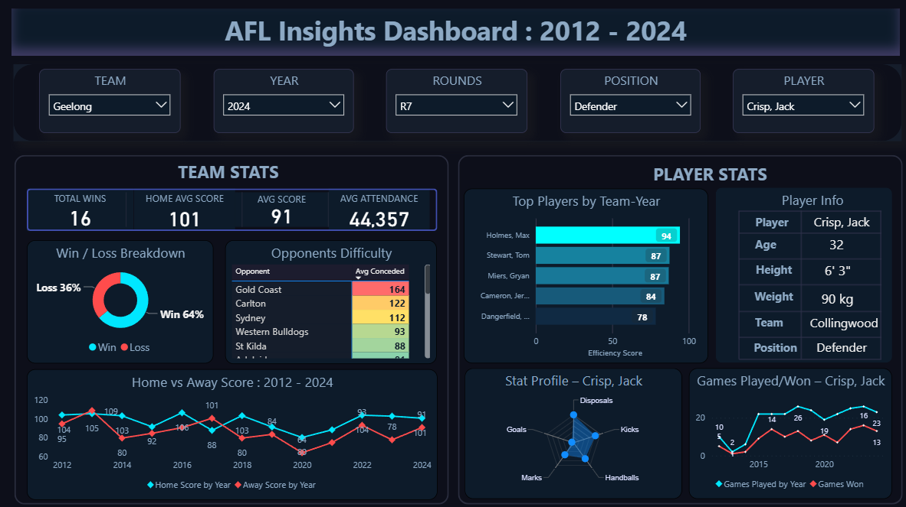

# 🏉 AFL Insights Dashboard (2012–2024) 📊  
  

> 🎯 A fully interactive, futuristic Power BI dashboard to explore AFL player and team stats from 2012 to 2024.

---

## 🎬 AFL Analytics Showcase

> 🚀 **Explore efficiency, match trends, player profiles & more in one sleek, dark-themed dashboard.**  

📌 Designed with a neon blue-purple aesthetic, smart filters, custom visuals, and optimized slicer interactions.

---

## 📎 [Click here to view the interactive dashboard →](https://www.novypro.com/project/afl-insights-dashboard-2012%E2%80%932024)

> *(Opens in a new tab — no login required)*

---

## 🧩 Key Features

✅ **Top 5 Player Rankings**  
✅ Dynamic Slicers (Team, Year, Round, Position, Player)  
✅ Player Radar Chart (Skills Spread)  
✅ Games Played vs Games Won Line Chart  
✅ Opponent Difficulty Heatmap  
✅ Interactive Tooltips & Conditional Formatting  
✅ Fully Responsive Layout  
✅ Modern UI/UX Styling  
✅ Drilldowns by Year, Round, and Player

---

## 📷 Preview

---

## 🛠️ Built With

| Tool           | Purpose                |
|----------------|------------------------|
| Power BI       | Data visualization     |
| DAX            | Measures & logic       |
| Excel (CSV)    | Source data cleaning   |

---

## 🧪 How to Use

1. Clone this repo or download the `.pbix` file.
2. Open in Power BI Desktop (latest version).
3. Refresh using sample AFL dataset or connect your own.
4. Click around the slicers to filter the visuals in real-time.

---

## 📁 Folder Structure

